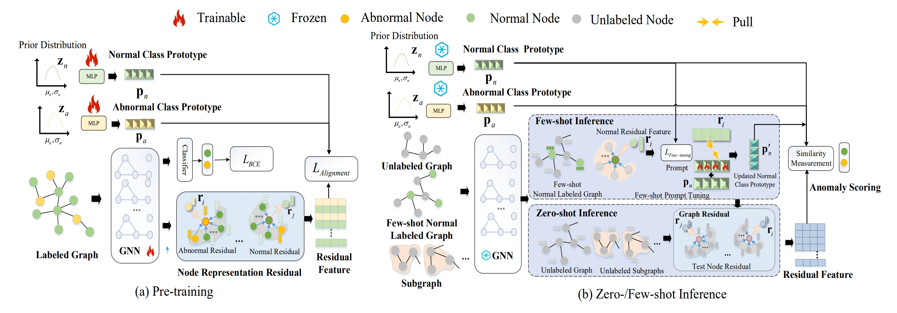

<div align="center">
  <h2><b> AnomalyGFM: Graph Foundation Model for Zero/Few-shot Anomaly Detection </b></h2>
</div>

<div align="center">


[](https://badges.pufler.dev/visits/mala-lab/AnomalyGFM)

[**📜 Datasets**](https://drive.google.com/drive/folders/1SSWgFRdth3U44_IMRnW775B1l-bjQATW?usp=sharing) [**📝 arxiv**](https://arxiv.org/abs/2502.09254)

</div>


> 1️⃣ AnomalyGFM is the **first** GAD-oriented GFM with strong zero-shot and few-shot generalization abilities. 

> 2️⃣ AnomalyGFM is pre-trained to learn discriminative, graph-agnostic class prototypes with normal and abnormal residual features, and it supports few-shot graph prompt tuning for better adaptation.

> 3️⃣ A comprehensive benchmark on both zero-shot and few-shot settings using 11 real-world GAD datasets is established, on which i) AnomalyGFM performs significantly
better the state-of-the-art unsupervised, supervised, and generalist GAD methods, and ii) AnomalyGFM can scale up to very large graphs





The GAD datasets after feature alignment can be obtained from   [google drive link](https://drive.google.com/drive/folders/1SSWgFRdth3U44_IMRnW775B1l-bjQATW?usp=sharing). 

The code for  both AnomalyGFM and the adaptation to the baseline methods will be uploaded in this week.


## Citation
If you find this repo useful, please cite our paper.

```bibtex
@article{qiao2025anomalygfm,
  title={AnomalyGFM: Graph Foundation Model for Zero/Few-shot Anomaly Detection},
  author={Qiao, Hezhe and Niu, Chaoxi and Chen, Ling and Pang, Guansong},
  journal={arXiv preprint arXiv:2502.09254},
  year={2025}
}
```
