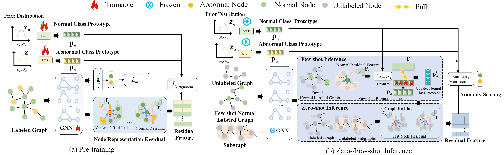

<div align="center">
  <h2><b> AnomalyGFM: Graph Foundation Model for Zero/Few-shot Anomaly Detection </b></h2>
</div>

<div align="center">


[**📜 Datasets**](https://drive.google.com/drive/folders/1SSWgFRdth3U44_IMRnW775B1l-bjQATW?usp=sharing) [**📝 arxiv**](https://arxiv.org/abs/2502.09254)
</div>


## Promotional Video

📢 We are excited to share that our paper presentation video is now available on YouTube!

🎬 Watch it here: [[YouTube Link](https://youtu.be/OrY9epUwh0M?si=izAi9xjQuNLQmaMX)]

📌 Your feedback and support are greatly appreciated!


## Main Contributions


> 1️⃣ AnomalyGFM is the **first** GAD-oriented GFM with strong zero-shot and few-shot generalization abilities. 

> 2️⃣ AnomalyGFM is pre-trained to learn discriminative, graph-agnostic class prototypes with normal and abnormal residual features, and it supports few-shot graph prompt tuning for better adaptation.

> 3️⃣ A comprehensive benchmark on both zero-shot and few-shot settings using 11 real-world GAD datasets is established, on which i) AnomalyGFM performs significantly
better the state-of-the-art unsupervised, supervised, and generalist GAD methods, and ii) AnomalyGFM can scale up to very large graphs





The GAD datasets after feature alignment can be obtained from   [google drive link](https://drive.google.com/drive/folders/1SSWgFRdth3U44_IMRnW775B1l-bjQATW?usp=sharing). 


## Requirements

To install requirements:

```setup
pip install -r requirements.txt
```

## Training and Zero-shot Inference  

To run the model(s), run this command:
```
python run_abnormal.py 
```

## Training and Few-shot Inference  

Run this command:
```
python run_finetune_normal.py 
```
For few-shot labeled normal nodes fine-tuning.

Run this command:
```
python run_finetune_abnormal.py 
```
for few-shot labeled abnormal nodes fine-tuning.

## Large-scale Graph Generalization 

Run this command:
```
python run_inference.py 
```

## Citation
If you find this repo useful, please cite our paper.

```bibtex
@inproceedings{qiao2025anomalygfm,
  title={AnomalyGFM: Graph foundation model for zero/few-shot anomaly detection},
  author={Qiao, Hezhe and Niu, Chaoxi and Chen, Ling and Pang, Guansong},
  booktitle={Proceedings of the 31st ACM SIGKDD Conference on Knowledge Discovery and Data Mining V. 2},
  pages={2326--2337},
  year={2025}
}
```
